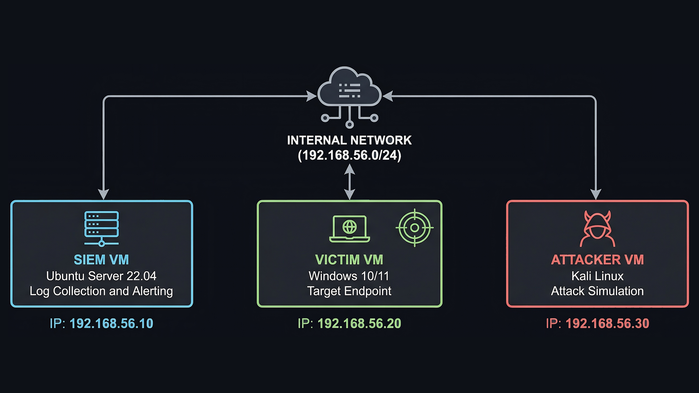

# Home SOC Lab

A home lab environment built to simulate real attacks, practice detection engineering, and document investigations end to end.

## Lab Setup

| Role     | OS                  | Purpose                         |
|----------|---------------------|---------------------------------|
| SIEM     | Ubuntu Server 22.04 | Log collection and alerting     |
| Victim   | Windows 10/11       | Target endpoint                 |
| Attacker | Kali Linux          | Attack simulation               |

## Network Diagram

## Attacks Covered

- RDP Brute Force
- PowerShell Encoded Command Execution
- Scheduled Task Persistence

## Tools

Wazuh, Sysmon, Hydra, PowerShell